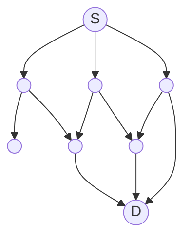
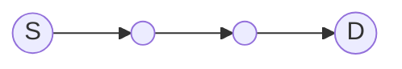
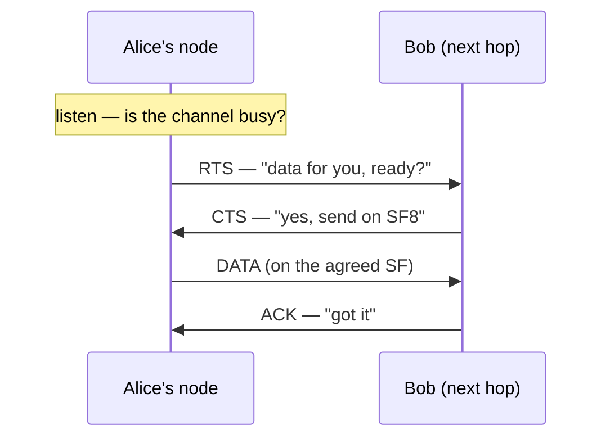
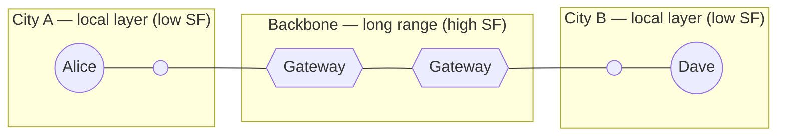

# How MeshRoute Works

*A LoRa mesh that routes on purpose instead of shouting everywhere. This page walks one message from one node to another — read the top for the gist, and open the **↓ deeper** boxes wherever you want the real mechanism.*

## The problem with flooding

Most LoRa mesh networks — Meshtastic and MeshCore among them — move messages (mostly!) by **flooding**: every node that hears a message rebroadcasts it, so it ripples outward until it has reached everyone. It is beautifully simple, and at small scale it simply works.

The trouble is airtime. LoRa is *slow*, and the radios are held to strict duty-cycle limits (in Europe, often around 1% of the time). So the airwaves are a tiny shared budget — and flooding spends it recklessly: every redundant rebroadcast burns time some other node needed, collisions pile up, and as the network grows denser it begins to choke on its own chatter.

Picture a crowded room where everyone repeats everything they hear — a little louder each time. That is a flood at scale.

There is another way: don't shout — **route**.

**Flooding — every node repeats to everyone:**

**MeshRoute — one chosen path:**

## The idea: route on purpose

MeshRoute treats airtime as the scarce resource it is. Instead of broadcasting blindly, nodes **learn who can reach whom** and send each message along a deliberately chosen path, one hop at a time.

That is a trade-off, and an honest one: a little more latency, and some bookkeeping to keep routes current. In return, you stop wasting airtime — which is exactly what dense, real-world deployments run out of first. The routing is **lazy** (refreshed only when it helps) and **self-adapting** (it follows link quality, and nodes coming and going).

Here is how it plays out for a single message.

## Follow a message

Alice's node wants to get a message to Dave's, a few hops away. Here is every decision that message passes through.

### 1. Find the route

First question: which way is Dave? Nodes answer that for each other with small periodic **beacons** — each node advertises what it can reach and how well ("I can reach Dave in 2 hops, on a good signal"). Every node folds the beacons it hears into a lightweight **routing table**, so when Alice's node looks up Dave it already knows the best **next hop** — say, Bob.

<b>↓ deeper — how routes are scored and kept fresh</b>

Beacons carry distance-vector entries (destination · next hop · a signal-quality score · hop count), which nodes merge into their tables. Each destination keeps up to **three** candidate routes — a primary plus alternates — ranked by link quality (SNR) and hop count. A route is refreshed only when a beacon actually improves it, and it **ages out** when it goes stale, so a node that disappears stops being advertised.

### 2. Grab the channel

Knowing the next hop is not permission to transmit. Alice's node first **listens** — is anyone already talking? — and then opens a tiny handshake rather than blasting the data out:

The **RTS** ("I have data for you — ready?") and **CTS** ("yes — and here is how to send it") reserve the moment so two senders do not talk over each other, and they let the *receiver* set the terms. Alice's node also checks its **duty-cycle budget** first — it will not spend more than its fair slice of the shared airtime.

<b>↓ deeper — what happens when the channel is busy</b>

"Listen first" is real carrier sensing (signal-strength / channel-activity detection). As a node's airtime budget drains, it moves through throttle **tiers** that make it back off more and more. And a receiver that cannot take the message right now does not drop it silently — it replies with a **NACK** carrying a short "try again in N ms," so the sender backs off cleanly instead of hammering a busy neighbour.

### 3. Pick the spreading factor

LoRa lets you trade **speed for range** with a setting called the *spreading factor* (SF): a low SF is fast but needs a strong signal; a high SF reaches much farther but takes far longer on air.

Here is the neat part — the **receiver** is the one who knows how good the link is, so it names the SF to use in its CTS. A strong, close hop gets a fast SF; a weak, distant hop gets a slow, far-reaching one. Every hop is **right-sized**, so MeshRoute never burns slow airtime on a link that did not need it.

<b>↓ deeper — control vs. data spreading factor</b>

Control traffic — beacons and the RTS/CTS handshake — rides one shared SF so every node in the layer can hear it. The **data** then moves on the SF the receiver picked (somewhere in the 5–12 range) from the measured signal quality. Splitting the two keeps a reliable common channel while still right-sizing every payload.

### 4. Send, confirm, repeat

Now the **DATA** goes out on the agreed SF, and Bob replies with an **ACK** — Alice's node knows the hop landed. Then Bob runs the very same dance toward the next node along the way: look up the route, handshake, right-size the SF, send, confirm. Hop by deliberate hop, the message walks to Dave.

<b>↓ deeper — when a hop fails</b>

Every message carries a **hop budget** (a TTL) so it cannot wander forever, and a small **"visited" list** in the frame so it cannot loop back on itself. If a next hop goes quiet, the sender does not give up — it **falls back to one of its alternate routes** for that destination and tries again.

### 5. Cross into another layer

One mesh cannot grow without limit, so MeshRoute splits a large network into **layers** — each holding up to roughly **250** nodes, with its own control channel. When Dave lives in a *different* layer, a **gateway** carries the message across: a gateway is simply a node that belongs to more than one layer, and a cross-layer message is addressed with an explicit path through the gateway-connected layers.

Because each layer runs on its own spreading factor, layers can take on different roles. Picture a whole **city** as one layer on a fast, short-range SF — plenty of local capacity. A second, **long-range** layer on a high SF then bridges that city to the next, and a node sitting in both — a **gateway** — passes messages between the local mesh and the long-haul backbone. Local chat stays local and quick; a message bound for the other city rides the slow, far-reaching backbone and drops back into the destination city's fast local layer at the far end.

That is how MeshRoute scales past a single mesh **without** collapsing the whole thing back into one giant flood domain — the very property the layers exist to avoid.

## Also in the box

MeshRoute is more than these five steps. A few other pieces, in brief:

- **Joining** — a new node claims a local address through a short handshake, with no central authority handing them out.
- **Anti-spam** — a per-node airtime budget keeps one chatty device from crowding out everyone else.
- **End-to-end delivery** — optionally, the *final* destination confirms receipt, not just the next hop along the way.
- **Mobility** — nodes that move, sleep, or drop in and out are absorbed as the topology shifts under them.

## Where this is

MeshRoute is an early but complete protocol proposal — the design is done and the first firmware builds are close. For the byte-level detail behind any of this, see the protocol specification and the source in this repository. If the approach resonates, follow along or get involved.
