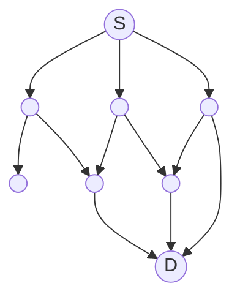
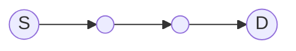
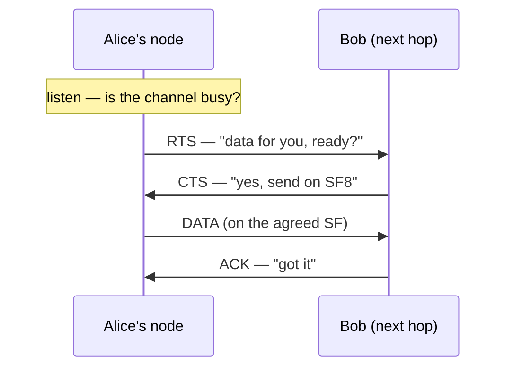
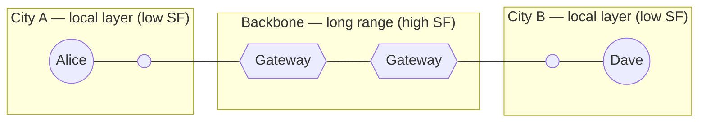

# How MeshRoute Works

*A LoRa mesh that routes on purpose instead of shouting everywhere. This page walks one message from one node to another — read the top for the gist, and open the **↓ deeper** boxes wherever you want the real mechanism.*

## The problem with flooding

Most LoRa mesh networks — Meshtastic and MeshCore among them — move messages (mostly!) by **flooding**: every node that hears a message rebroadcasts it, so it ripples outward until it has reached everyone. It is beautifully simple, and at small scale it simply works.

The trouble is airtime. LoRa is *slow*, and the radios are held to strict duty-cycle limits (in Europe, often around 1% of the time)[^duty]. So the airwaves are a tiny shared budget — and flooding spends it recklessly: every redundant rebroadcast burns time some other node needed, collisions pile up, and as the network grows denser it begins to choke on its own chatter.

Picture a crowded room where everyone repeats everything they hear — a little louder each time. That is a flood at scale.

There is another way: don't shout — **route**.

**Flooding — every node repeats to everyone:**

**MeshRoute — one chosen path:**

## The idea: route on purpose

MeshRoute treats airtime as the scarce resource it is. Instead of broadcasting blindly, nodes **learn who can reach whom** and send each message along a deliberately chosen path, one hop at a time.

That is a trade-off, and an honest one: a little more latency, and some bookkeeping to keep routes current. In return, you stop wasting airtime — which is exactly what dense, real-world deployments run out of first. The routing is **lazy** (refreshed only when it helps) and **self-adapting** (it follows link quality, and nodes coming and going).

Here is how it plays out for a single message.

## Follow a message

Alice's node wants to get a message to Dave's, a few hops away. Here is every decision that message passes through.

### 1. Find the route

First question: which way is Dave? Nodes answer that for each other with small periodic **beacons** — each node advertises what it can reach and how well ("I can reach Dave in 2 hops, on a good signal"). Every node folds the beacons it hears into a lightweight **routing table**, so when Alice's node looks up Dave it already knows the best **next hop** — say, Bob.

<b>↓ deeper — how routes are scored and kept fresh</b>

Beacons carry distance-vector entries (destination · next hop · a signal-quality score · hop count), which nodes merge into their tables. Each destination keeps up to **three** candidate routes — a primary plus alternates — ranked by link quality (SNR) and hop count. A route is refreshed only when a beacon actually improves it, and it **ages out** when it goes stale, so a node that disappears stops being advertised.

### 2. Grab the channel

Knowing the next hop is not permission to transmit. Alice's node first **listens** — is anyone already talking? — and then opens a tiny handshake rather than blasting the data out:

The **RTS** ("I have data for you — ready?") and **CTS** ("yes — and here is how to send it") reserve the moment so two senders do not talk over each other, and they let the *receiver* set the terms. Alice's node also checks its **duty-cycle budget** first — it will not spend more than its fair slice of the shared airtime.

<b>↓ deeper — what happens when the channel is busy</b>

"Listen first" is real carrier sensing (signal-strength / channel-activity detection). As a node's airtime budget drains, it moves through throttle **tiers** that make it back off more and more. And a receiver that cannot take the message right now does not drop it silently — it replies with a **NACK** carrying a short "try again in N ms," so the sender backs off cleanly instead of hammering a busy neighbour.

### 3. Pick the spreading factor

LoRa lets you trade **speed for range** with a setting called the *spreading factor* (SF): a low SF is fast but needs a strong signal; a high SF reaches much farther but takes far longer on air.

Here is the neat part — the **receiver** is the one who knows how good the link is, so it names the SF to use in its CTS. A strong, close hop gets a fast SF; a weak, distant hop gets a slow, far-reaching one. Every hop is **right-sized**, so MeshRoute never burns slow airtime on a link that did not need it.

<b>↓ deeper — control vs. data spreading factor</b>

Control traffic — beacons and the RTS/CTS handshake — rides one shared SF so every node in the layer can hear it. The **data** then moves on the SF the receiver picked (somewhere in the 5–12 range) from the measured signal quality. Splitting the two keeps a reliable common channel while still right-sizing every payload.

### 4. Send, confirm, repeat

Now the **DATA** goes out on the agreed SF, and Bob replies with an **ACK** — Alice's node knows the hop landed. Then Bob runs the very same dance toward the next node along the way: look up the route, handshake, right-size the SF, send, confirm. Hop by deliberate hop, the message walks to Dave.

<b>↓ deeper — when a hop fails</b>

Every message carries a **hop budget** (a TTL) so it cannot wander forever, and a small **"visited" list** in the frame so it cannot loop back on itself. If a next hop goes quiet, the sender does not give up — it **falls back to one of its alternate routes** for that destination and tries again.

  

  
<b>↓ deeper — what if the ACK goes missing?</b>

  If the DATA lands but its ACK is lost on the way back, the sender cannot tell the hop succeeded, so it retries — and the receiver
  could end up holding two copies. The recovery rides on the next handshake: the receiver remembers what it just delivered, so when
  the sender re-sends its RTS it answers with a CTS flagged **"already received"** — *stop, I have it* — and the sender drops the
  message instead of resending. If even that confirmation is missed and the sender eventually reroutes through an alternate hop, a
  second copy can start travelling; that is harmless, because the **duplicate guard** recognises the repeat where the copies
  converge and keeps just one.

  

### 5. Cross into another layer

One mesh cannot grow without limit, so MeshRoute splits a large network into **layers** — each holding up to roughly **250** nodes, with its own control channel. When Dave lives in a *different* layer, a **gateway** carries the message across: a gateway is simply a node that belongs to more than one layer, and a cross-layer message is addressed with an explicit path through the gateway-connected layers.

Because each layer runs on its own spreading factor, layers can take on different roles. Picture a whole **city** as one layer on a fast, short-range SF — plenty of local capacity. A second, **long-range** layer on a high SF then bridges that city to the next, and a node sitting in both — a **gateway** — passes messages between the local mesh and the long-haul backbone. Local chat stays local and quick; a message bound for the other city rides the slow, far-reaching backbone and drops back into the destination city's fast local layer at the far end.

And layers need not even share a *frequency*. Because each layer is logically separate, a leaf and a backbone — or two neighbouring leaves — can run on **different frequencies** as well as different spreading factors. It opens real room to grow: layers on different frequencies do not compete for the same airtime at all, and a backbone could sit on a sub-band that permits a more generous duty cycle. Separating layers across both frequency *and* spreading factor multiplies the network's usable capacity.

That is how MeshRoute scales past a single mesh **without** collapsing the whole thing back into one giant flood domain — the very property the layers exist to avoid.

## Also in the box

MeshRoute is more than these five steps. A few other pieces, in brief:

- **Joining** — a new node claims a local address through a short handshake, with no central authority handing them out.
- **Anti-spam** — a per-node airtime budget keeps one chatty device from crowding out everyone else.
- **End-to-end delivery** — optionally, the *final* destination confirms receipt, not just the next hop along the way.
- **Mobility** — nodes that move, sleep, or drop in and out are absorbed as the topology shifts under them.

## How a node builds its routing table

Everything above leans on one thing: every node knowing a good next hop for each destination it cares about. That knowledge is the **routing table** — and it is built entirely from the beacons nodes overhear, with no central map and no coordinator. This is the part most worth understanding if you want to really *get* MeshRoute, so here is how it comes together.

**It is distance-vector — you trust your neighbours' summaries.** A beacon does not describe the whole network; it lists what *that* node can reach: for each destination, a next hop, a hop count, and a quality score. When your node hears Bob's beacon say "I can reach Dave in 2 hops," it reasons: *I can hear Bob, so I can reach Dave in 3 hops — by handing the message to Bob.* That becomes a candidate route to Dave, with Bob as the next hop. Every node does this with every beacon it hears, and reachability spreads outward, hop by hop.

**Routes compete on quality, not just distance.** This is the MeshRoute twist. A classic mesh keeps the *fewest-hop* route and stops. MeshRoute scores each route by the **weakest link along its path** — the chain's lowest signal quality (SNR) — *as well as* its hop count. A three-hop path of strong links can beat a two-hop path with one marginal link, because the marginal link is where messages actually fail. Signal quality is tracked as a smoothed average, so one noisy moment does not whipsaw the table.

| Destination | Next hop | Weakest link | Hops |
|---|---|---|---|
| Dave *(primary)* | Bob | strong | 3 |
| Dave *(alternate)* | Carol | marginal | 2 |
| Erin | Carol | strong | 2 |

**A few candidates, not one.** For each destination the table keeps up to **three** routes — a primary plus alternates — ranked by that score and hop count. The alternates earn their keep: when a next hop goes quiet mid-delivery, the sender immediately *cascades* to the next-best candidate instead of failing (the "fall back to an alternate" from step 4).

**It stays cheap, and it stays current.** Re-advertising everything constantly would burn the very airtime MeshRoute exists to protect, so beacons are **differential** — a node marks changed routes as *dirty* and sends those first, trickling the stable ones out over later beacons. And nothing lives forever: every route **ages out** if its next hop stops being heard (sooner for direct neighbours, later for distant destinations), so a node that powers off or walks away quietly disappears from everyone's tables.

<b>↓ deeper — loops, and neighbours that go quiet</b>

Two safeguards keep the table honest. **Split-horizon:** a node never advertises a route *back* to the neighbour it learned it from, and hop counts are capped — so routes cannot spiral into loops. **Peer liveness:** when a neighbour stops answering, it slides through *suspect → silent → dead* tiers, each adding a growing penalty to every route that runs through it. The table quietly steers around a flaky node long before it formally expires — and snaps back if the node recovers.

## Protecting the airtime budget

We opened on a promise: airtime is the scarce resource, and where flooding squanders it, MeshRoute spends it on purpose. Every mechanism so far has quietly served that promise — and pulling them together is the best way to see what makes the protocol tick, because *defending the airtime budget* is the thread that runs from the radio all the way up to the application.

**Every node keeps its own budget.** A node continuously tracks how much airtime it has spent over a recent window and weighs it against the legal duty-cycle limit. As the budget drains it slides through tiers — **relaxed → strained → critical → exhausted** — throttling harder at each step and going briefly silent when it nears the edge. A node never transmits its way past the limit; it backs *itself* off first.

**It never talks over anyone.** Before any transmission a node listens — real channel sensing, not optimism. If the air is busy, it waits. That is the same listen-before-talk from the handshake, applied everywhere: airtime already in use is not airtime to fight over.

**Beacons are disciplined.** Routing knowledge has to spread, but beacons are pure overhead, so MeshRoute spends them sparingly:

- **Differential** — a beacon carries the routes that *changed*, not the whole table (the dirty-first trick from the last chapter).
- **Triggered, not just periodic** — a beacon fires when something actually changes, then waits out a minimum interval, jittered so neighbours do not all speak at once.
- **Quiet when the channel is busy** — if the air has been congested, beacons hold off rather than pile on.

A settled, healthy network therefore goes remarkably quiet: it speaks only when it has something new to say.

**No single node may hog the mesh.** Finally, MeshRoute watches *originators*. Each source is allowed only a bounded **share** of the shared airtime, and a node relaying others' traffic notices when one originator is spending more than its share and throttles it — so a chatty or misbehaving device cannot drown out everyone else.

<b>↓ deeper — the actual thresholds</b>

The duty-cycle tiers engage at roughly **50%** (strained), **80%** (critical), and **95%** (exhausted) of the budget, each imposing a longer enforced-silence window as it escalates. An originator is held to about a **quarter** of the shared airtime over a five-minute window, with repeat sends de-duplicated within ~10 seconds so a retry is not counted as new traffic. Triggered beacons keep a minimum gap of a couple of minutes between fires, jittered by a few seconds to break up synchrony.

Put together, that is the whole point. Flooding treats airtime as free and finds out otherwise; MeshRoute treats it as a budget and manages it at every layer — the radio listens first, the node rations its own duty cycle, routing whispers only its changes, and no single talker takes more than its share. That discipline is exactly what lets a MeshRoute network stay usable where a flood would collapse: dense, busy, and real.

## Where this is

MeshRoute is an early but complete protocol proposal — the design is done and the first firmware builds are close. For the byte-level detail behind any of this, see the protocol specification and the source in this repository. If the approach resonates, follow along or get involved.

[^duty]: Duty-cycle limits depend on local regulations and the chosen frequency. In the EU 868 MHz band most sub-bands cap transmit time near 1% (some at 0.1%), but a few allow more — including the 869.4–869.65 MHz sub-band MeshRoute uses, which permits up to 10%. Other regions (such as US 915 MHz) follow different rules entirely.
