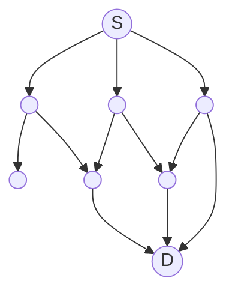
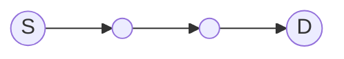
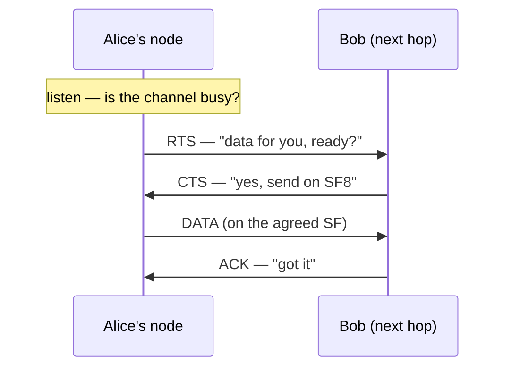
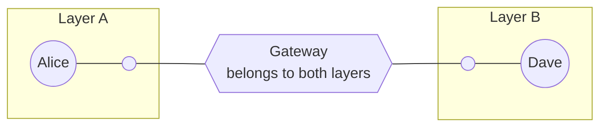

# How MeshRoute Works — Doc Page Implementation Plan

> **For agentic workers:** REQUIRED SUB-SKILL: Use superpowers:subagent-driven-development (recommended) or superpowers:executing-plans to implement this plan task-by-task. Steps use checkbox (`- [ ]`) syntax for tracking. (For THIS doc, inline execution by one writer is the better fit — see Execution Handoff — to keep a single voice.)

**Goal:** Build the public "How MeshRoute Works" explainer at `docs/how-it-works.md`, linked from the README — a layered "follow a message" walkthrough with collapsible deep-dives and a couple of diagrams.

**Architecture:** One Markdown page; "follow a message" spine; an accessible main thread with GitHub `<details>` "↓ deeper" asides for depth; Mermaid for the diagrams (GitHub-native, versioned, never drifts from the text); linked from the README top. Design spec: `docs/specs/2026-05-30-how-it-works-doc-design.md`.

**Tech Stack:** Markdown · Mermaid (`sequenceDiagram` + `graph`) · GitHub `<details>` collapsibles.

**Verification note:** there is no automated test for a page. "Verify" = preview the Markdown (GitHub preview, VS Code Markdown preview, or a Mermaid live editor) and confirm it renders + reads + is technically accurate against the spec and the protocol facts below. **Commits:** stage only the doc files named in each task (`git add <path>`, never `-A`) — the working tree has another instance's in-flight `lib/`/`test/` changes; do not sweep them in.

**Protocol facts to keep the page accurate** (source: `~/lora-universal-simulator/scenarios/dv_dual_sf.lua`):
- Beacons carry distance-vector route entries (dest · next-hop · SNR score · hops); tables keep up to **K=3** alternates per dest, are refreshed lazily, and age out stale routes.
- Channel access per hop: listen-before-talk → **RTS → CTS → DATA → ACK**; the **CTS names the data spreading factor**; a duty-cycle budget (EU 10% sub-band, ~1% typical) gates transmissions; busy receivers reply **NACK** with a back-off.
- Spreading factor (SF) trades airtime for range; control traffic runs on one SF, data on a receiver-chosen SF (5–12). Strong link → low SF (fast); weak link → high SF (far).
- Layers hold up to ~**250** nodes with their own control SF; **gateways** belong to >1 layer and forward along an explicit layer path.
- "Also in the box": join state machine (address with no central authority), anti-spam (per-originator airtime budget), optional **end-to-end ACK** (final-destination confirmation), mobility.

---

### Task 1: Scaffold the page

**Files:**
- Create: `docs/how-it-works.md`

- [ ] **Step 1: Create the page skeleton**

Write the title, a one-sentence lede, and the section headers (content filled in later tasks):

```markdown
# How MeshRoute Works

*A LoRa mesh that routes on purpose instead of shouting everywhere. Here's how a single message gets from one node to another — start at the top; open the **↓ deeper** boxes when you want the real mechanism.*

## The problem with flooding

## The idea: route on purpose

## Follow a message

### 1. Find the route

### 2. Grab the channel

### 3. Pick the spreading factor

### 4. Send, confirm, repeat

### 5. Cross into another layer

## Also in the box

## Where this is
```

- [ ] **Step 2: Verify** — preview the file; confirm headings render and the outline reads in order.

- [ ] **Step 3: Commit**

```bash
git add docs/how-it-works.md
git commit -m "docs(how-it-works): scaffold the explainer page"
```

---

### Task 2: Write the hook — "The problem" + "The idea"

**Files:**
- Modify: `docs/how-it-works.md` (the two intro sections)

- [ ] **Step 1: Write "The problem with flooding"** (~120 words). Cover, in plain language:
  - Flood-based meshes (name **Meshtastic / MeshCore** once, neutrally) rebroadcast every message to everyone — simple and robust at small scale.
  - Why it breaks when dense: LoRa is **slow** and **duty-cycle-capped** (in Europe often ~1%), so airtime is a tiny shared budget. Every redundant rebroadcast spends time *someone else needed*; collisions rise; the network chokes on its own chatter.
  - Analogy: *a crowded room where everyone repeats everything they hear — louder each time.*
  - End on the turn: "There's another way: don't shout — route."

- [ ] **Step 2: Write "The idea: route on purpose"** (~90 words):
  - MeshRoute treats airtime as scarce and **routes deliberately**: nodes learn who-can-reach-whom and send each message along a chosen path, hop by hop.
  - The honest trade-off (don't oversell): a little more latency and bookkeeping, for far less wasted airtime where it counts — dense, real deployments.
  - One line on the flavor: routes are learned *lazily* and kept *self-adapting* (signal quality, nodes coming and going).

- [ ] **Step 3: Verify** — read both sections; confirm the hook lands and the "problem → idea" turn is clean; no jargon left unexplained.

- [ ] **Step 4: Commit**

```bash
git add docs/how-it-works.md
git commit -m "docs(how-it-works): problem + idea hook"
```

---

### Task 3: Diagram D1 — flooding vs routing

**Files:**
- Modify: `docs/how-it-works.md` (embed under "The problem with flooding")

- [ ] **Step 1: Add two labelled Mermaid graphs** right after the problem prose. Flooding shows one source reaching many neighbours that each re-broadcast (busy); routing shows a single highlighted path S→D. Use exactly:

````markdown
**Flooding — every node repeats to everyone:**



**MeshRoute — one chosen path:**


````

- [ ] **Step 2: Verify** — render the Mermaid (GitHub preview or mermaid.live); confirm the first graph looks busy/branchy and the second is a single clean line, and both label S and D. (If GitHub ever fails to render, the fallback is a small committed SVG in `docs/img/` — note only; not needed now.)

- [ ] **Step 3: Commit**

```bash
git add docs/how-it-works.md
git commit -m "docs(how-it-works): D1 flooding-vs-routing diagram"
```

---

### Task 4: Journey steps 1–3 (find route · grab channel · pick SF) + D2

**Files:**
- Modify: `docs/how-it-works.md` ("Follow a message" intro + steps 1–3)

- [ ] **Step 1: Write the "Follow a message" intro** (~40 words): set the scene — *Alice's node wants to send "hi" to Dave's node, a few hops away. Here's every decision the message passes through.*

- [ ] **Step 2: Write "1. Find the route"** (~90 words main + aside):
  - Main: nodes periodically send small **beacons** advertising what they can reach ("I can reach Dave in 2 hops, good signal"). Each node folds these into a lightweight **routing table**; Alice's node looks up Dave and picks the best **next hop** (say, Bob).
  - Aside (`<details><summary>↓ deeper: how routes are scored & kept fresh</summary>`): distance-vector merge; SNR-based link **score**; up to **K=3** alternates per destination; routes refreshed only when useful and **aged out** when stale.

- [ ] **Step 3: Write "2. Grab the channel"** (~90 words main + aside) and embed D2:
  - Main: Alice's node doesn't just blast. It **listens first**, then runs a tiny handshake — **RTS** ("data for you — ready?") → **CTS** ("yes — use this spreading factor"). That reserves the moment so two senders don't collide, and lets the receiver set the terms. It also respects a **duty-cycle budget** — it won't exceed its fair slice of airtime.
  - Embed D2 (Mermaid sequence) right here:

````markdown

````

  - Aside (`↓ deeper: when the channel is busy`): listen-before-talk via RSSI/CAD; duty-cycle **tiers** that throttle as the budget drains; a busy receiver replies **NACK** with a back-off instead of dropping silently.

- [ ] **Step 4: Write "3. Pick the spreading factor"** (~90 words main + aside):
  - Main: LoRa trades **speed for range** via spreading factor — a strong, close link uses a **fast** SF (cheap airtime); a weak, distant link uses a **slow, far-reaching** SF. The *receiver* knows the link quality, so it names the SF in the CTS. Every hop is **right-sized** — no burning slow airtime on a strong link.
  - Aside (`↓ deeper: control vs data SF`): control traffic (beacons, RTS/CTS) rides one shared SF so everyone hears it; **data** moves on the receiver-chosen SF (5–12) from the measured SNR.

- [ ] **Step 5: Verify** — render; confirm the D2 sequence shows listen→RTS→CTS→DATA→ACK; confirm the three `<details>` blocks collapse/expand; check the main thread still reads cleanly with the asides closed.

- [ ] **Step 6: Commit**

```bash
git add docs/how-it-works.md
git commit -m "docs(how-it-works): journey steps 1-3 + handshake diagram"
```

---

### Task 5: Journey steps 4–5 (confirm+repeat · cross a layer) + D3

**Files:**
- Modify: `docs/how-it-works.md` (steps 4–5)

- [ ] **Step 1: Write "4. Send, confirm, repeat"** (~80 words main + aside):
  - Main: the **DATA** goes out on the chosen SF; Bob **ACKs** it. Now Bob does the exact same dance toward the next hop — look up the route, handshake, right-size the SF, send, confirm. Hop by hop, deliberately, the message walks to Dave.
  - Aside (`↓ deeper: when a hop fails`): a **hop budget** (TTL) bounds how far a message travels; **loop guards** (a small "visited" set carried in the frame) stop it circling; if a next hop goes quiet, the sender **falls back to an alternate** route rather than giving up.

- [ ] **Step 2: Write "5. Cross into another layer"** (~90 words main) and embed D3:
  - Main: one mesh can't grow forever, so MeshRoute splits big networks into **layers** (~250 nodes each, with their own control channel). A **gateway** — a node that belongs to two layers — carries messages across, and a cross-layer message is addressed with an explicit path through the gateway-connected layers. That's how it scales past one mesh **without** turning the whole thing into one giant flood domain.
  - Embed D3 (Mermaid graph):

````markdown

````

- [ ] **Step 3: Verify** — render; confirm D3 shows two layers bridged by a gateway; confirm the step-4 aside collapses; re-read the whole journey end-to-end for flow.

- [ ] **Step 4: Commit**

```bash
git add docs/how-it-works.md
git commit -m "docs(how-it-works): journey steps 4-5 + layers/gateway diagram"
```

> **Optional trim:** if you'd rather cap at two diagrams, drop the D3 Mermaid block (keep the prose) — the "a diagram or two" call. Leave D1 + D2 as the core.

---

### Task 6: Tail — "Also in the box" + "Where this is"

**Files:**
- Modify: `docs/how-it-works.md` (final two sections)

- [ ] **Step 1: Write "Also in the box"** — a tight bullet list, one line each, each linking onward (to the repo / `PROTOCOL.md` once public):
  - **Joining** — a new node gets a local address through a short handshake, with no central authority.
  - **Anti-spam** — a per-node airtime budget stops one chatty device from hogging the mesh.
  - **End-to-end ACK** — optional confirmation that the *final* destination got it, not just the next hop.
  - **Mobility** — nodes that move, sleep, or come and go are handled as the topology shifts.

- [ ] **Step 2: Write "Where this is"** (~40 words): status — the protocol design is complete and first firmware is close; point to the repo and note the deeper protocol spec for byte-level detail. Keep it short and honest.

- [ ] **Step 3: Verify** — read; confirm the list is one-line-each (not mini-essays) and the page ends cleanly.

- [ ] **Step 4: Commit**

```bash
git add docs/how-it-works.md
git commit -m "docs(how-it-works): also-in-the-box + status tail"
```

---

### Task 7: Link it from the README

**Files:**
- Modify: `README.md` (add a prominent link near the top)

- [ ] **Step 1: Check the README isn't mid-edit by the other instance** — `git status --short README.md`. If it shows uncommitted changes you didn't make, pause and coordinate before staging.

- [ ] **Step 2: Add the link** immediately after the opening "What Is MeshRoute?" paragraph:

```markdown
> 📖 **New here? [How MeshRoute works →](docs/how-it-works.md)** — a short, diagram-led walkthrough of how a message actually travels.
```

- [ ] **Step 3: Verify** — preview the README; confirm the link resolves to `docs/how-it-works.md`.

- [ ] **Step 4: Commit**

```bash
git add README.md
git commit -m "docs(readme): link the How-it-works explainer"
```

---

### Task 8: Final pass — render, accuracy, voice, length

**Files:**
- Modify: `docs/how-it-works.md` (polish only)

- [ ] **Step 1: Full render check** — preview the whole page: all Mermaid blocks render, every `<details>` opens/closes, all links resolve.
- [ ] **Step 2: Accuracy check** — re-read against the "Protocol facts" block above and the design spec; fix anything imprecise (K=3, CTS-names-SF, duty cycle, ~250/layer, gateway-in-two-layers).
- [ ] **Step 3: Voice & length check** — confirm: plain/active voice, short paragraphs, analogy intact, main thread reads top-to-bottom with all asides *closed*, ~3–4 screens. Trim any paragraph that drifts into spec detail (push it into an aside or cut it).
- [ ] **Step 4: Commit** (only if Step 2/3 changed anything)

```bash
git add docs/how-it-works.md
git commit -m "docs(how-it-works): final accuracy + voice pass"
```

---

## Self-review (completed by plan author)

- **Spec coverage:** §1 audience/layered → the `<details>` mechanic (Tasks 4–5). §2 scope (routing/channel/SF/layers) → journey steps 1–5 (Tasks 4–5); "also in the box" → Task 6. §3 outline → Tasks 1–6 one-to-one. §4 layering mechanic → asides in Tasks 4–5. §5 diagrams D1/D2/D3 → Tasks 3/4/5 (D4/D5 dropped per "a diagram or two"). §6 voice/length → Task 8. §7 home + README link → Tasks 1/7. §9 open Qs resolved: diagram count = D1+D2+D3 with D3 trim option (Task 5); competitors named once (Task 2). No gaps.
- **Placeholder scan:** diagram sources are complete Mermaid; prose tasks specify content, length, and aside text (not "write a section about X"). No TBDs.
- **Consistency:** file path `docs/how-it-works.md` and section names match across all tasks; diagram labels (S/D, Alice/Bob/Dave, Layer A/B, Gateway) consistent; SF8 used consistently in D2.
